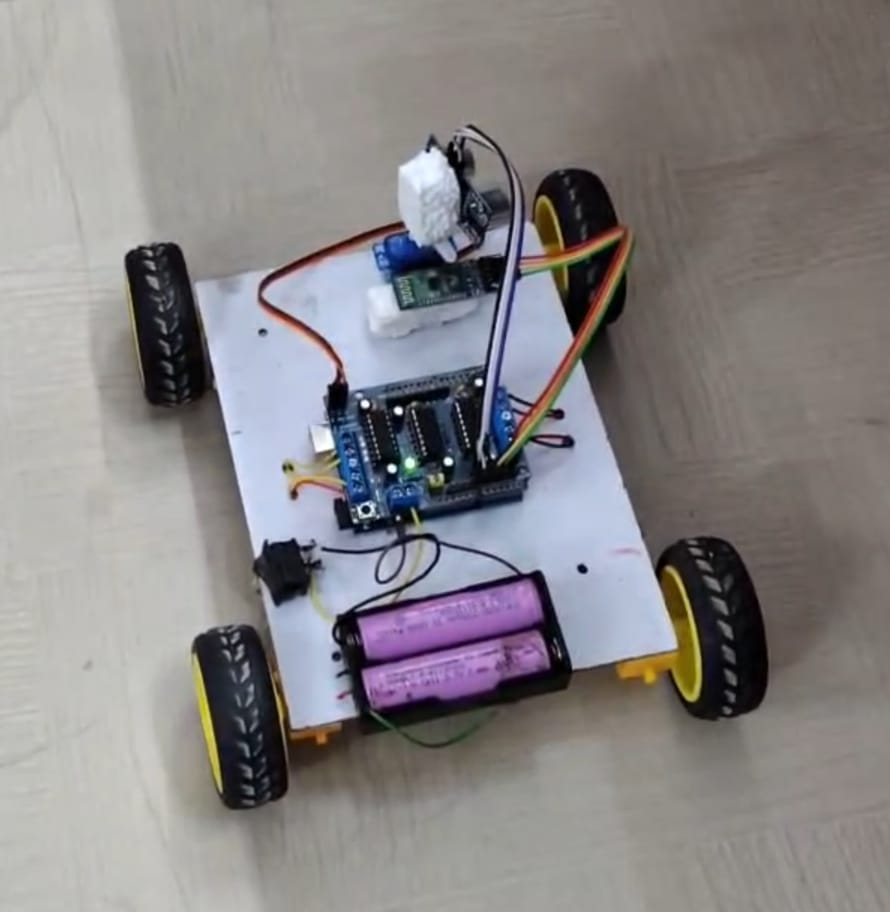

# Dual-Mode Autonomous & Bluetooth-Controlled Robotic Car🚗🤖

  

An embedded robotics project featuring **Dual-Mode Operation**: Fully autonomous self-driving navigation with ultrasonic obstacle avoidance, combined with real-time smartphone Bluetooth control and emergency crash prevention overrides.

---

## 📌 Key Highlights

- **Dual-Mode Navigation:** Easily switch between fully autonomous self-driving mode and manual smartphone control via Bluetooth (HC-05).
- **Autonomous Collision Avoidance:** Real-time distance measurement using an HC-SR04 ultrasonic sensor to detect obstacles and recalculate paths dynamically.
- **Dynamic 180° Sonar Sweep:** SG90 micro-servo motor rotates the ultrasonic sensor to scan left, right, and center for maximum clearance.
- **Active Safety Override:** Automatically suppresses manual forward commands and halts the vehicle if an obstacle is detected in manual Bluetooth mode.
- **Optimized Power Architecture:** Powered by a 2x 3.7V Lithium-ion battery pack (7.4V total) configured to eliminate microcontroller brownouts during motor load spikes.

---

## 🛠️ Hardware Stack & Specifications

| Component | Functionality |
| :--- | :--- |
| **Arduino Uno** | Microcontroller handling real-time control algorithms and signal decoding |
| **HC-SR04 Sensor** | High-precision ultrasonic distance measurement |
| **SG90 Servo Motor** | 180-degree directional panning for real-time environment scanning |
| **HC-05 Bluetooth Module** | Low-latency serial communication with smartphone interface |
| **L293D Motor Driver** | Bidirectional dual H-Bridge control for 4 DC gear motors |
| **4x DC Gear Motors** | 4-wheel differential drive transmission |
| **2x 3.7V Li-ion (7.4V)** | High-discharge dedicated power supply |

---

## ⚙️ Operating Modes & Working Logic

1. **Fully Autonomous Mode:**
   - The rover drives forward while continuously probing for obstacles.
   - When an obstacle is detected within the safety distance threshold, the vehicle halts.
   - The servo sweeps left (180°) and right (0°) to calculate the clearest open path.
   - The rover autonomously turns toward the direction with maximum clearance and resumes motion.

2. **Bluetooth Gamepad Mode:**
   - The rover receives standard directional control inputs (`Forward`, `Reverse`, `Left`, `Right`, `Stop`) from a mobile app.

3. **Emergency Auto-Brake Override:**
   - While operating in Bluetooth mode, background sensor checks remain active. If the user drives toward a wall or obstacle, the safety routine immediately cuts motor power to prevent structural impact.

---

## 🚀 Future Scope

- Integration of real-time camera feed via ESP32-CAM for FPV driving.
- Addition of IR speed encoders for closed-loop PID velocity control.
- Implementation of ROS (Robot Operating System) for SLAM-based indoor mapping.

---

## 👤 Author

- **Developed by:** **Harsh Krishna**
